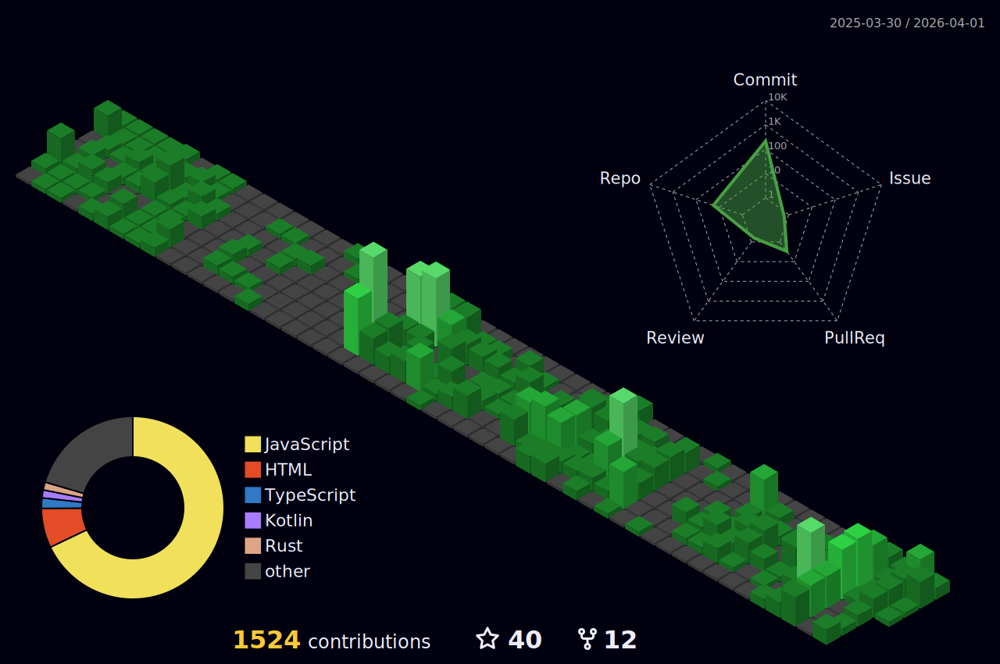

 

  

<h1 align="center">Afyf Badreddine</h1>
<h3 align="center">AI Engineer | LLMs, NLP, Computer Vision, and Applied Automation</h3>

  <a href="mailto:afyfbadreddine@gmail.com">afyfbadreddine@gmail.com</a> •
  <a href="https://github.com/badrafyf77">github.com/badrafyf77</a> •
  Berrechid, Morocco

  

## About Me

- AI engineer passionate about building useful, production-ready intelligent systems.
- Currently completing a Master of Excellence in Artificial Intelligence (FS Ben M'Sik, Casablanca).
- Interested in LLM applications, RAG systems, prompt engineering, and real-time AI interfaces.
- Open to internships, collaboration, and AI engineering opportunities.

## Experience Snapshot

- AI Engineer Intern at Events Week (Rabat): built an AI-powered web chatbot with context-aware responses and automated assistance.
- Developer Intern at SEWS CABIND (Berrechid): developed a desktop app for multi-site IT asset management using Flutter, Firebase, MVVM, and BLoC.

## Tech Stack

- Programming: C, C++, Java, PHP, VB, Python, Dart, SQL
- AI/ML: PyTorch, TensorFlow, Scikit-learn, Keras, Hugging Face, LangChain
- AI Focus: LLMs, NLP, Computer Vision, Fine-tuning, RAG, Prompt Engineering
- Deployment and MLOps: Docker, FastAPI, Git, AWS
- Automation: n8n, LangGraph, Amazon Bedrock

## Selected Projects

1. Real-time Moroccan traffic sign detection and classification using YOLOv11n and a custom dataset.
2. Intelligent Interview Assistant: real-time voice pipeline (Whisper STT -> streaming LLM -> TTS) with turn-taking and interruption handling.
3. Customer Support Automation: n8n + RAG + Pinecone workflow with ticket routing and automated email support.

  
  
  

 

 
 

## GitHub Analytics

<h3 align='center'><strong>Github Analytics ⚙️</strong></h3>

  

  
  

  

  

  

  

## How To Generate Your Own Stats and GIFs

1. 3D contributions: generated by workflow file `.github/workflows/profile-3d.yml`. It already uses the repository owner automatically, so it works when pushed to your profile repo.
2. Space shooter GIF: generated by workflow file `.github/workflows/space-shooter.yml` and saved to `assets/space-shooter.gif`.
3. Snake animation: generated by workflow file `.github/workflows/snake.yml` and published to branch `output`.
4. Stats cards: URLs in this README use `username=badrafyf77`. Replace only the `username` query value if you ever change account.

## Quick Setup Checklist

1. Create a profile repository named exactly `badrafyf77` on GitHub.
2. Push this project to that repository.
3. Open Actions tab on GitHub and run workflows once with `Run workflow`.
4. Wait 1-2 minutes, then refresh the profile page.

